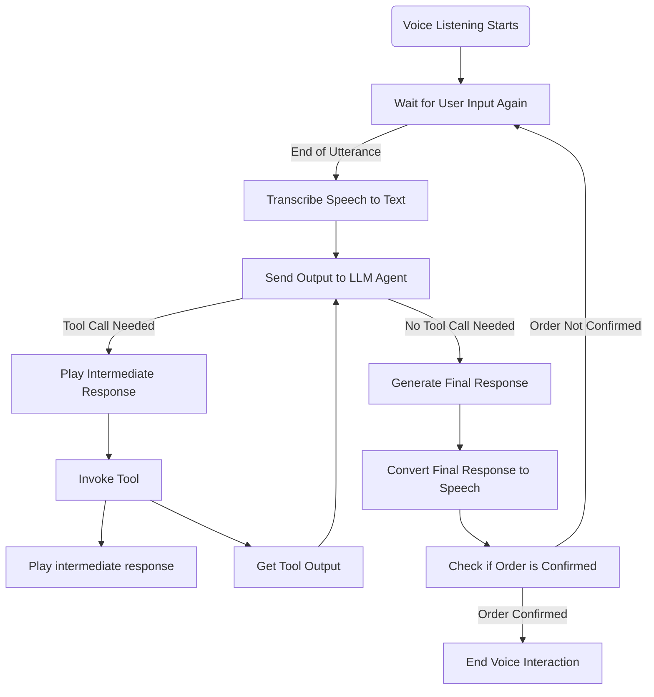

# KFC Food Ordering Assistant

## Overview
The KFC Food Ordering Assistant is an low-latency interactive voice assistant designed to streamline the ordering process at KFC.



### Installation

1. Clone the repository:
```bash
git clone https://github.com/sajithamma/kfc.git
cd kfc
```

---
2. Setting up virtual environment
- Creating virtual environment
    ```bash 
    python -m venv venv
    ```

- Activating on windows:
    ```bash
    .\venv\Scripts\activate
    ```

- Activating on linux:
    ```bash
    source venv/bin/activate
    ```
    
- Installing dependencies:
    ```bash
    pip install -r requirements.txt
    ```

---
3. Set up API keys (one time):
    - Create a `.env` file in the project root folder.
    - Go to [Assembly ai's website](https://www.assemblyai.com/), login and get an API key paste it inside `.env` file as `ASSEMBLY_API_KEY=<your-api-key>`.
    - Go to [Deepgram's website](https://deepgram.com/), login and get an API key paste it inside `.env` file as `DEEPGRAM_API_KEY=<your-api-key>`.
    - For llm either use groq or openai:
        - Go to [Groq's website](https://groq.com/), login and get the API key then paste it inside `.env` as `GROQ_API_KEY=<your-api-key>`.

        - Go to [Open website](https://openai.com/), login and get the API key then paste it inside `.env` as `OPENAI_API_KEY=<your-api-key>`.


**Note:** To enable rotation of api keys for groq, set a variable `GROQ_API_KEYS=["<api-key1>", "<api-key2>", "<api-key3>"]` or `OPENAI_API_KEYS=["<api-key1>", "<api-key2>", "<api-key3>"]` in `.env` and set `ROTATE_LLM_API_KEYS` variable to be `True` in `config.py`.

---
4. Run the application:
```bash
python app.py
```

---

### Project Structuring:

#### Webview and related UI methods: 

    - web_builder/builder.py : For Webview class and related UI manipulation methods.
    - web_builder/templates.py : For html template definitions.

#### Assistant Utilities related Classes and Methods:

    - assistant/agent.py : Contains Speech to text, Text to speech, Langchain agent definitions and Wake-word detector.
    - assistant/menu.py : Contains the menu parent class and its subclass for cart with singleton definition with available items.
    - assistant/tools.py : Contains the langchain agent tools whose functionalities where defined within `assistant/menu.py/OrderCart` classes methods.
    - assistant/utils.py : Contains the pydantic model definitions and Microphone object class for the `assemblyai` to listen with (package's Microphone class didn't had a pause option)

#### startup.py:

    - Initializes all utility classes.

#### config.py:

    - Defines debugging, system prompt, global variables etc.

#### app.py:
Contains two main functions:
    - `main1` method uses voice features as user input to assistant.
    - `main2` method uses console input as user input to assistant.

#### Note: All intermediate voice plays and UI updates are done from the tool calls itself from `assistant/menu.py/OrderCart` and `assistant/menu.py/KFCMenu` class's methods