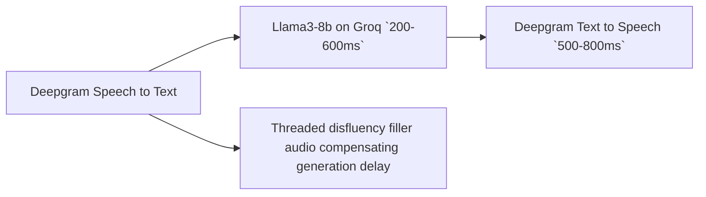

# KFC Food Ordering Assistant

## Overview
The KFC Food Ordering Assistant is an low-latency interactive voice assistant designed to streamline the ordering process at KFC.



### Installation

1. Clone the repository:
```bash
git clone https://github.com/sajithamma/kfc.git
cd kfc
```


2. Install poetry for dependency management: 
```bash 
pip install poetry
```

2. Install the required dependencies:
```bash
poetry install
```

4. Set up API keys (one time):
    - Create a `.env` file in the project root folder.
    - Go to [Deepgram's website](https://deepgram.com/), login and get an API key paste it inside `.env` file as `DEEPGRAM_API_KEY=<your-api-key>`.
    - Go to [Groq's website](https://groq.com/), login and get the API key then paste it inside `.env` as `GROQ_API_KEY=<your-api-key>`.


3. Run the application:
```bash
poetry run python test.py
```
